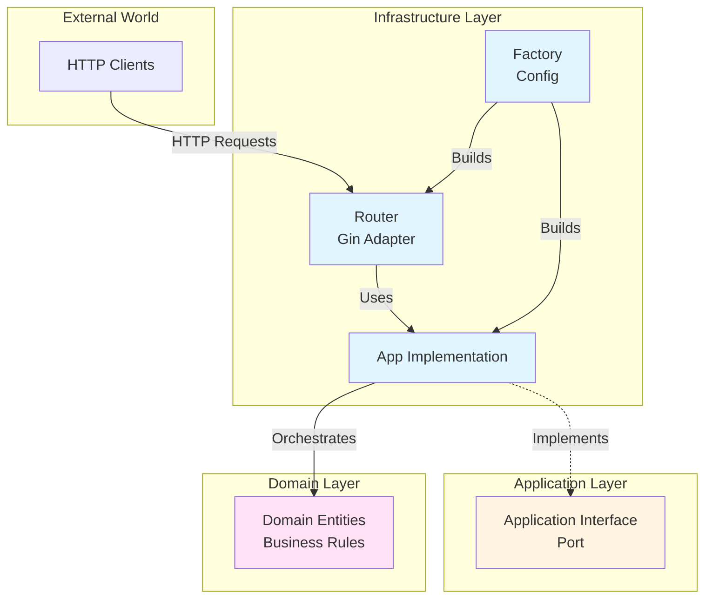
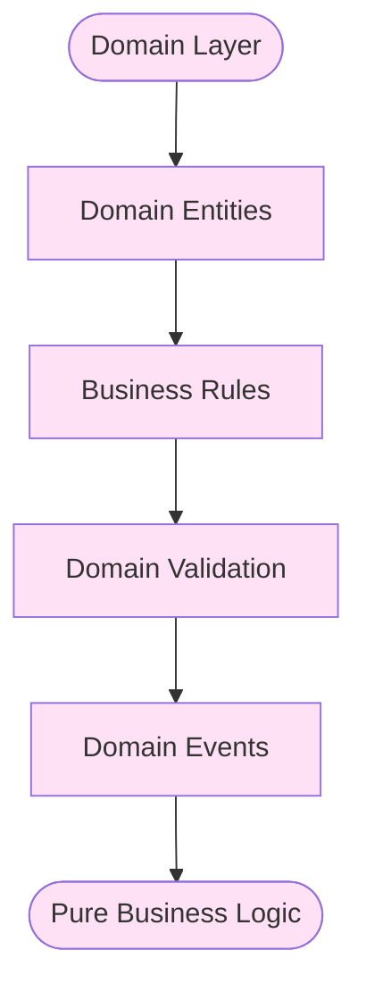
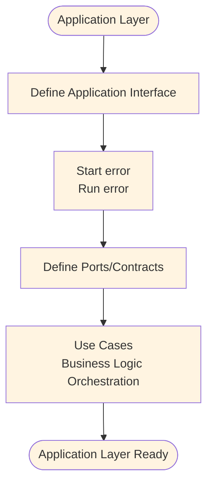
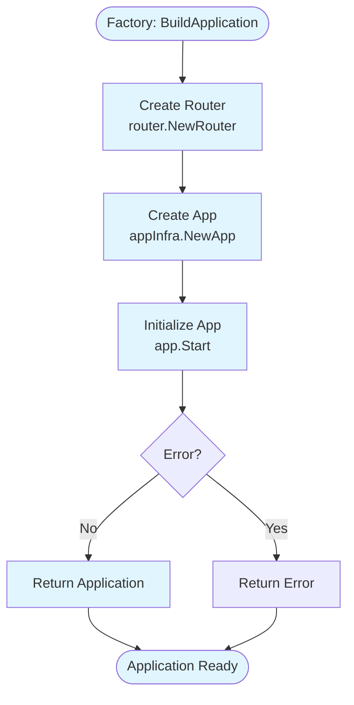
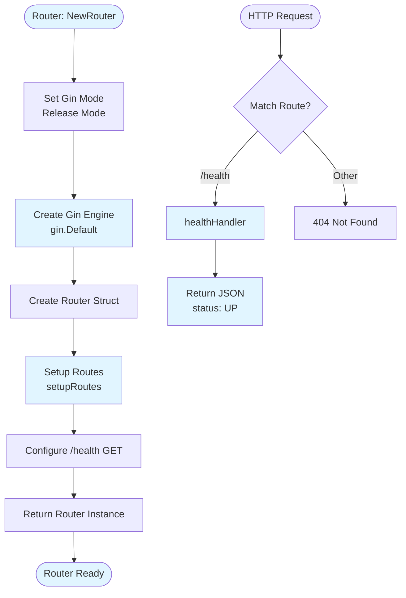
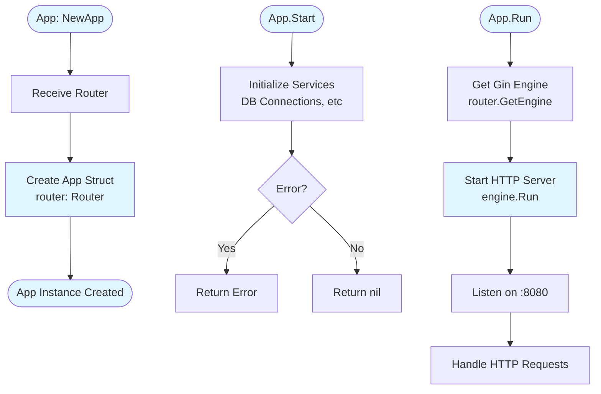
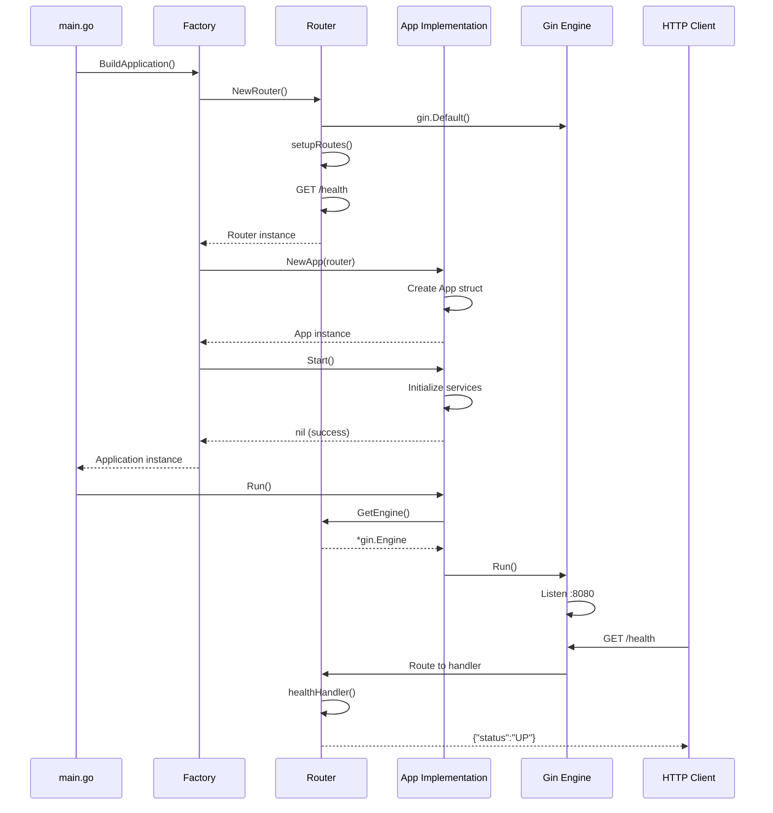

# GenAI Test - Arquitectura Hexagonal

Proyecto base implementado en Go utilizando arquitectura hexagonal (ports & adapters), Gin como router HTTP, y preparado para testing con Ginkgo v2 y Gomega.

## 📋 Tabla de Contenidos

- [Arquitectura](#arquitectura)
- [Estructura del Proyecto](#estructura-del-proyecto)
- [Componentes](#componentes)
- [Diagramas de Flujo](#-diagramas-de-flujo)
- [Flujo de Ejecución Completo](#-flujo-de-ejecución-completo)
- [Instalación](#instalación)
- [Uso](#uso)
- [Endpoints](#endpoints)
- [Testing](#testing)
- [Dependencias](#dependencias)

## 🏗️ Arquitectura

Este proyecto sigue los principios de la **Arquitectura Hexagonal** (también conocida como Ports & Adapters), que separa la lógica de negocio de los detalles de infraestructura mediante puertos (interfaces) y adaptadores (implementaciones).

### Capas de la Arquitectura

#### 1. **Domain Layer** (`domain/`)
- **Propósito**: Contiene las entidades de dominio y reglas de negocio puras
- **Responsabilidad**: Define el core del negocio sin dependencias externas
- **Estado actual**: Preparado para futuras implementaciones

#### 2. **Application Layer** (`application/`)
- **Propósito**: Contiene la lógica de negocio, casos de uso y puertos (interfaces)
- **Responsabilidad**: 
  - Define los contratos (interfaces) que deben implementar los adaptadores
  - Contiene los casos de uso de la aplicación
  - Orquesta la lógica de negocio
- **Componentes**:
  - `application.go`: Define la interfaz `Application` que abstrae el ciclo de vida de la aplicación

#### 3. **Infrastructure Layer** (`infrastructure/`)
- **Propósito**: Contiene adaptadores, rutas y configuraciones externas
- **Responsabilidad**:
  - Implementa las interfaces definidas en la capa Application
  - Maneja detalles técnicos (HTTP, bases de datos, servicios externos)
  - Configura y construye toda la estructura de la aplicación
- **Subdirectorios**:
  - `router/`: Adaptador HTTP utilizando Gin
  - `application/`: Implementación concreta de la interfaz Application
  - `config/`: Factory pattern para construcción de dependencias

### Principios Aplicados

- **Separación de Responsabilidades**: Cada capa tiene una responsabilidad clara
- **Inversión de Dependencias**: La capa de infraestructura depende de la capa de aplicación, no al revés
- **Testabilidad**: Las interfaces facilitan el testing mediante mocks
- **Flexibilidad**: Cambiar implementaciones de infraestructura no afecta la lógica de negocio

## 📁 Estructura del Proyecto

```
genai-test/
├── application/              # Capa de aplicación
│   └── application.go       # Interfaz Application
├── domain/                  # Capa de dominio
│                           # (preparado para entidades)
├── infrastructure/         # Capa de infraestructura
│   ├── application/        # Implementación de Application
│   │   └── app.go         # App struct que implementa Application
│   ├── config/            # Factory y configuración
│   │   └── factory.go     # BuildApplication() - construye toda la app
│   └── router/            # Adaptador HTTP
│       └── router.go      # Router con Gin y rutas
├── main.go                 # Punto de entrada
├── go.mod                  # Dependencias del proyecto
├── go.sum                  # Checksums de dependencias
└── README.md              # Este archivo
```

## 🔧 Componentes

### 1. Interfaz Application

Define el contrato principal de la aplicación:

```go
type Application interface {
    Start() error  // Inicializa la aplicación
    Run() error   // Ejecuta la aplicación (servidor HTTP)
}
```

**Ubicación**: `application/application.go`

### 2. Router

Encapsula Gin y configura las rutas HTTP:

```go
type Router struct {
    engine *gin.Engine
}
```

**Métodos principales**:
- `NewRouter()`: Crea e inicializa el router con las rutas configuradas
- `setupRoutes()`: Configura todas las rutas de la aplicación
- `GetEngine()`: Retorna el engine de Gin para uso interno

**Ubicación**: `infrastructure/router/router.go`

### 3. App (Implementación de Application)

Implementación concreta de la interfaz `Application`:

```go
type App struct {
    router *router.Router
}
```

**Responsabilidades**:
- Orquesta el ciclo de vida de la aplicación
- Inicializa servicios (en `Start()`)
- Ejecuta el servidor HTTP (en `Run()`)

**Ubicación**: `infrastructure/application/app.go`

### 4. Factory

Patrón Factory para construcción de dependencias:

```go
func BuildApplication() (application.Application, error)
```

**Flujo de construcción**:
1. Crea el Router mediante `router.NewRouter()`
2. Crea la Application mediante `appInfra.NewApp(r)`
3. Inicializa la aplicación con `app.Start()`
4. Retorna la instancia lista para ejecutar

**Ubicación**: `infrastructure/config/factory.go`

### 5. Main

Punto de entrada de la aplicación:

```go
func main() {
    app, err := config.BuildApplication()
    if err != nil { /* ... */ }
    
    err = app.Run()
    if err != nil { /* ... */ }
}
```

**Responsabilidades**:
- Invoca el factory para construir la aplicación
- Maneja errores de inicialización y ejecución
- Ejecuta `Application.Run()`

## 📊 Diagramas de Flujo

### Diagrama General de Arquitectura Hexagonal



### Flujo de la Capa Domain



### Flujo de la Capa Application



### Flujo de la Capa Infrastructure - Factory



### Flujo de la Capa Infrastructure - Router



### Flujo de la Capa Infrastructure - Application Implementation



## 🔄 Flujo de Ejecución Completo



## 📦 Instalación

### Requisitos

- Go 1.24+ (o compatible)
- Git

### Pasos

1. Clonar el repositorio:
```bash
git clone https://github.com/fd95i/genai-test.git
cd genai-test
```

2. Instalar dependencias:
```bash
go mod download
```

3. Compilar:
```bash
go build -o genai-test .
```

## 🚀 Uso

### Ejecutar la aplicación

```bash
./genai-test
```

O directamente con Go:

```bash
go run main.go
```

### Verificar que está funcionando

```bash
curl http://localhost:8080/health
```

Respuesta esperada:
```json
{"status":"UP"}
```

## 🌐 Endpoints

### GET /health

Endpoint de health check para verificar el estado de la aplicación.

**Request**:
```http
GET /health HTTP/1.1
Host: localhost:8080
```

**Response**:
```json
{
  "status": "UP"
}
```

**Status Code**: `200 OK`

## 🧪 Testing

El proyecto está preparado para testing con **Ginkgo v2** y **Gomega**. Las dependencias están instaladas, pero la configuración de tests está pendiente de implementación.

### Dependencias de Testing

- `github.com/onsi/ginkgo/v2 v2.27.2`
- `github.com/onsi/gomega v1.38.2`

### Próximos Pasos

- [ ] Configurar suite de tests con Ginkgo
- [ ] Crear tests para el Router
- [ ] Crear tests para la Application
- [ ] Crear tests de integración

## 📚 Dependencias

### Runtime

- `github.com/gin-gonic/gin v1.11.0` - Router HTTP

### Development

- `github.com/onsi/ginkgo/v2 v2.27.2` - Framework de testing
- `github.com/onsi/gomega v1.38.2` - Matchers para Ginkgo

### Instalar nuevas dependencias

```bash
go get <paquete>
go mod tidy
```

## 🔮 Próximos Pasos

- [ ] Implementar casos de uso en la capa Application
- [ ] Agregar entidades de dominio
- [ ] Configurar tests con Ginkgo v2
- [ ] Agregar más endpoints y handlers
- [ ] Implementar repositorios (ports) para persistencia
- [ ] Agregar middleware para logging, CORS, etc.
- [ ] Configurar variables de entorno

## 📝 Licencia

Este proyecto es un ejemplo educativo de arquitectura hexagonal en Go.

## 👤 Autor

Federico Nuñez

